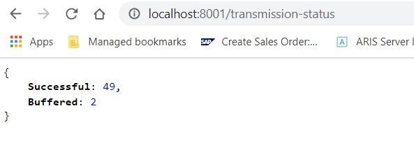

# iot-controller
Client-Server programs to handle sensor data transmission from client to server efficiently

 

<h2>Features:</h2>
<ul>
  <li>Transport sensor data to server through HTTP</li>
  <li>Uses Flask to expose services to post data(server) or read data transmission status(edge)</li>
  <li>Stores data in buffer in case of unsuccessful data transmission</li> 
  <li>Multi-Threaded edge program to handle buffered data and live data separately</li>
</ul>  

<h2>Requirements:</h2>
<ul>
  <li>Python 3.6 and above</li>
  <li>Flask 1.1.2</li>
</ul>

<h2>How to use?</h2>
<ul>
  <li>Clone Repository</li>
  <pre>git clone https://github.com/gurpreet-5555/iot-controller.git</pre>  </ul>
<ul><li>Execute Server Program</li>
<pre>python server.py --csvpath=sensorLog.csv --port=8000</pre>
<pre>Arguments (Server)-
csvpath : Path for sensor data log file. Default file is sensorLog.csv (Optional)
port : Port to receive sensor data. Default port is 8000 (Optional)
</pre></ul>
<ul><li>Execute Edge Program</li>
<pre>python edge.py --csvpath=sensorData.csv --port=8001 --server=http://127.0.0.1:8000/log-sensor-data --senddelay=60 --bufferdelay=5</pre>
<pre>Arguments (Edge)-
csvpath : Path for sensor data input file (Required)
port : Port for status service. Default port is 8001 (Optional)
server: Server path to send data (Required)
senddelay: Seconds to wait before sending next sensor data record. Default value is 60 seconds (Optional)
bufferdelay: Seconds to wait before sending all buffered data. Default value is 5 seconds (Optional)
</pre>
<pre>Link to access data transmission status in Edge program: http://{egde_program_hostname}:{port}/transmission-status</pre>
</ul>

  

